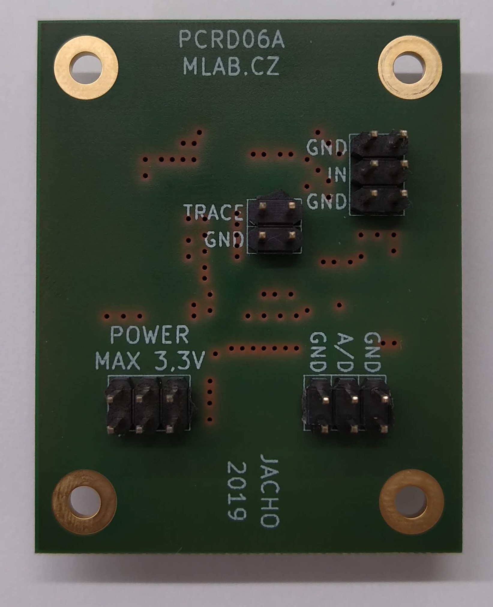

<!--- PrjInfo ---> <!--- Please remove this line after manually editing --->
<!--- 00a56be08b96043df9e37d6aff7b6990 --->
<!--- Created:2019-08-04 12:46:39.528455: --->
<!--- Author:: --->
<!--- AuthorEmail:: --->
<!--- Tags:: --->
<!--- Ust:: --->
<!--- Label --->
<!--- ELabel --->
<!--- Name:PCRD06A: --->
# PCRD06A Sample and hold circuit with analog memory
<!--- LongName --->
Signal follower with analog memory. It is a circuit equivalent to a sample-hold circuit triggered by a falling edge of signal or a circuit equivalent to a peak detector. The PCRD06A module is normally used in combination with SiPM based scintillation detector.

  * [SIMP02](https://github.com/mlab-modules/SIPM02)
  * [USTSIPM01](https://github.com/ust-modules/USTSIPM01)

<!--- ELongName --->

<!--- Lead --->

<!--- ELead --->

<!--- Description --->

### Basic usage 

The circuit is able to operate in multiple modes. The operation mode depends on logics used to control the circuit.  

  1. The first operation mode is peak detector, which stores the maximal value of peak output from SiPM. This mode holds the maximal value of pulse until the circuit is reset (usually after AD conversion)
  2. Pulse discriminator, where the AD converted value is compared with predefined treshold. After passing this treshold the circuit should be reset. 
  3. Energy integrator in that mode signal is ADconverted as fast as possible, dose is integrated numerically over specified time interval. 

### Principle of function 

Signal output from scintillation detector are pulses. The pulses are stored in a specially developed sample-hold circuit that behaves as a signal follower and analog memory. When signal #PeakDetect_Trace is in H an analog switch U5 turns on and a signal at an output U2 follows a signal at input with slight delay which is done by R13 and C19. If signal #PeakDetect_Trace is switched to a high impedance state the analog switch U5 starts to be controlled by a comparator U1. In this case, when the input signal goes from high to low, a positive input of comparator will be at a higher voltage than negative input, following a voltage at capacitor C19.

It causes switching-off of the analog switch U5 and the capacitor C19 holds its last voltage value. This behavior is similar to a peak detector circuit. In the next step the stored voltage can be converted by ADC connected at the output and after this conversion the input #PeakDetect_Trace goes again to H and circuit changes behavior to signal follower circuit. The described sample-hold circuit does not suffer with typical peak detector circuits ills like insensitivity to small signals, mistreatment of negative signals or discharging the capacitor by leakage current through diodes.

Moreover, this circuit can be used as a pulse discriminator as well. The signal #PeakDetect_Trace can be connected to an input of digital circuits when it is controlled by the comparator U1. When the input signal goes from high to low, the signal #PeakDetect_Trace goes from high to low as well. This behavior can be used for detection of falling edge of signal. There is only one constraint of this circuit, the input signal can not change raising/falling time widely and RC time constant (R13, C19) must be chosen correctly, respecting the input signal time properties.

More details about the principle is in [DOCTORAL THESIS, Research on cosmic rays on board aircraft using a newly developed PIN diode detector, 2020, CTU in Prague](http://www.ujf.cas.cz/export/sites/ujf/.content/files/CRREAT/kakona_thesis.pdf)

<!--- EDescription --->
<!--- Content --->
<!--- EContent --->
 Generated with [MLABweb](https://github.com/MLAB-project/MLABweb). (2019-08-04)
